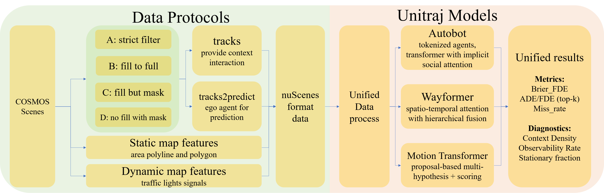
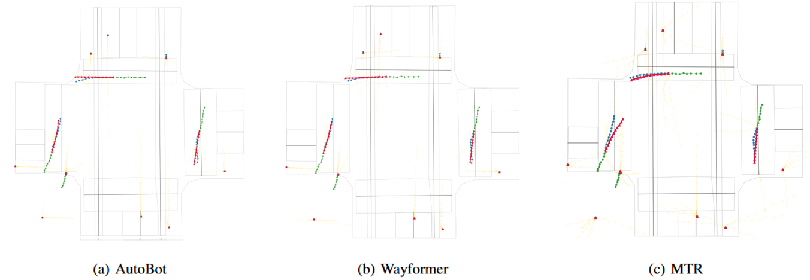

# FairTraj-COSMOS: Train-Rich, Eval-Pure Missingness Protocols for Calibration-Robust Trajectory Prediction  

**ZKLab, Columbia University**  
Wangshu Zhu (wz2708)  

[**Introduction Slides**](docs/FairTraj.pptx)  |  [**Paper**](docs/FairTraj.pdf)  
---

## 🔑 Overview  
Trajectory prediction in autonomous driving is frequently biased by how missing tracks—dropped frames, truncated observations, or occlusions—are handled. Existing benchmarks often smooth, impute, or filter tracks in ways that change task difficulty and calibration.  

**FairTraj-COSMOS** is the first **missingness-aware evaluation framework** for trajectory prediction, offering:  
- **Unified conversion** of real-world data into a standardized format with explicit valid masks.  
- **Four principled missingness protocols** (A–D) to disentangle preprocessing effects from true model capacity.  
- **Calibration-aware evaluation** with **Brier-FDE**, complementing conventional ADE/FDE/Miss Rate.  
- **Controlled experiments** on three representative architectures (AutoBot, Wayformer, MTR) showing that **Train-Rich, Eval-Pure (Protocol C)** yields the most reliable trade-off between accuracy and calibration.  


---

## 📂 Dataset: COSMOS @ NYC Intersection  
- **Unique resource**: Long-term video recordings from a fixed New York City intersection.  
- **Processing pipeline**: Extracted raw trajectories from video, converted into a **nuScenes-compatible format**.  
- **Missingness**: Frequent early exits, dropped frames, and occlusions.  
- **Protocols implemented**:  
  - **A – Strict Filter**: Only native full tracks.  
  - **B – Fill-as-Real**: Impute missing segments as ground truth.  
  - **C – Fill-but-Mask**: Rich training context, but evaluation remains native.  
  - **D – Zero-Impute**: Preserve missingness, masking absent frames.  


---

## ⚙️ Framework: UniTraj Spine  
We extend [UniTraj](https://arxiv.org/abs/2403.15098) as a **unified training/evaluation harness**:  
- **Scenario adapter**: Converts heterogeneous datasets into consistent tensors with valid masks.  
- **Batched inputs**: Standardized agent/map encoding with explicit masking.  
- **Unified evaluation**: ADE/FDE, Miss Rate, and **Brier-FDE** computed under identical semantics.  

---

## 🧩 Models  
We evaluate three diverse paradigms under the same framework:  
- **AutoBot** – Transformer with implicit set-based interactions.  
- **Wayformer** – Hierarchical attention with structured cross-stream fusion.  
- **MTR** – Anchor-based multi-agent forecasting with coarse-to-fine refinement.  


---

## 📊 Metrics  
- **Geometric Accuracy**: minADE@6, minFDE@6.  
- **Mode Coverage**: Miss rate @ 2m.  
- **Calibration**: **Brier-FDE**  
  \[
  \text{Brier-FDE} = \text{minFDE} + (1-p)^2
  \]  
  where \( p \) is the predicted probability of the closest-to-ground-truth mode.  

---

## 🔬 Key Findings  
- **Protocol Sensitivity**  
  - A: Lowest ADE, but weak calibration.  
  - B: Best FDE, but overconfident calibration.  
  - C: **Best trade-off** — rich training context, pure evaluation.  
  - D: Underperforms overall.  

- **Architecture Sensitivity** (Protocol C)  
  - Calibration: **MTR < Wayformer < AutoBot**.  
  - Geometric Accuracy: **AutoBot < Wayformer < MTR** (inverse order).  
  - Highlights the **probability–geometry trade-off** in model design.  

- **Practical Guideline**:  
  **Train-Rich, Eval-Pure (Protocol C)** is the most robust choice for calibration-critical applications.  

---

## 🚀 Reproducibility  

### 1. Environment  
- GPU: NVIDIA V100 (16 GB)  
- Python 3.9, PyTorch ≥ 1.13  
- Requirements in `requirements.txt`  

### 2. Data Preparation  
```bash
bash scripts/download_cosmos.sh
bash scripts/convert_to_nuscenes_format.sh
```
## 3. Training
```bash
python unitraj/train.py --model wayformer --protocol C
```
## 4. Evaluation
```bash
python unitraj/evaluate.py --checkpoint ckpt.pt --protocol A
```
## 5. Results  

All pre-computed results are available in `/results` and reported in our paper.  

### 📉 Representative Results  

| Protocol | ADE↓                  | FDE↓                  | Miss↓       | Brier-FDE↓          |
|----------|-----------------------|-----------------------|-------------|---------------------|
| **A-train** | ✓ lowest ADE          | fair FDE              | ✓ low Miss  | ✗ weak calibration  |
| **B-train** | good ADE              | ✓ lowest FDE          | moderate Miss | ✗ overconfident     |
| **C-train** | near-best ADE         | near-best FDE         | ✓ low Miss  | ✓ best calibration  |
| **D-train** | ✗ worst overall       | ✗ worst overall       | ✗ worst     | ✗ worst             |


## 📖 Citation  

If you use this work, please cite:  

```bibtex
@article{fairTrajCOSMOS2025,
  title={FairTraj-COSMOS: Train-Rich, Eval-Pure Missingness Protocols for Calibration-Robust Trajectory Prediction},
  author={Zhu, Wangshu and ZKLab},
  journal={arXiv preprint},
  year={2025}
}
